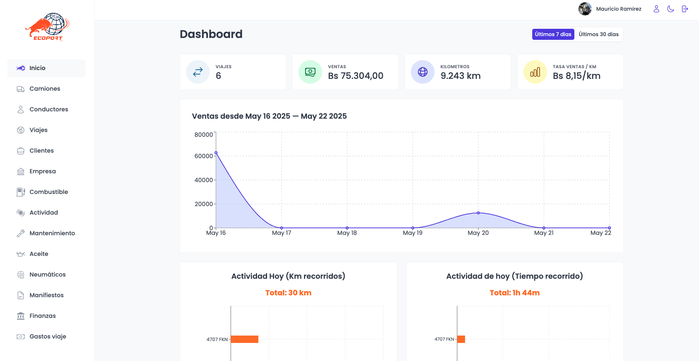
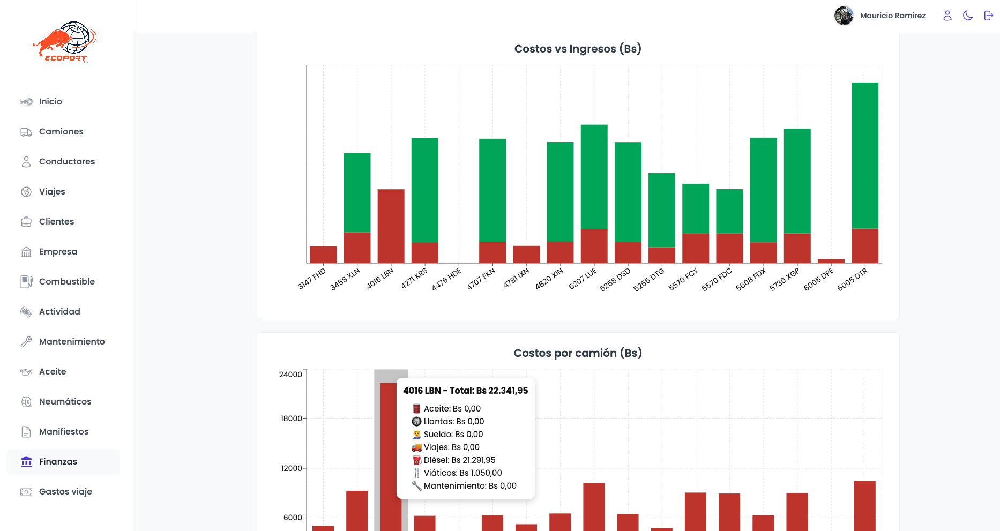
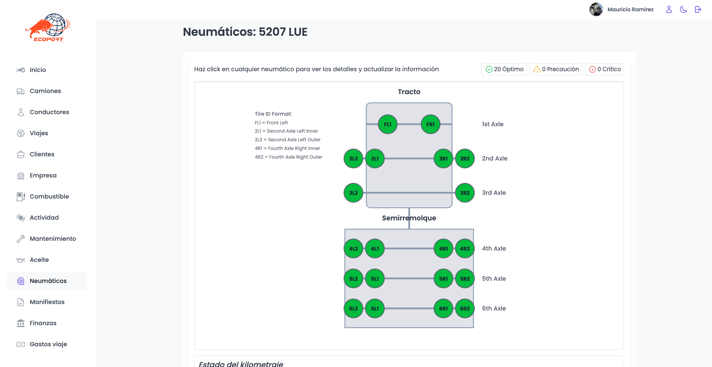
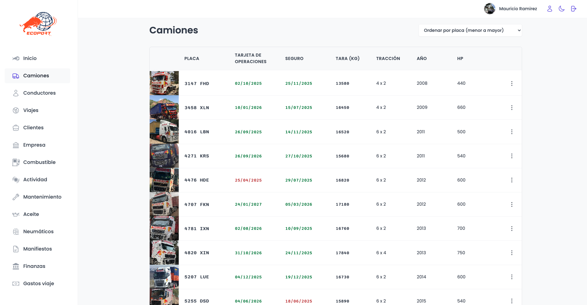

### Hi, I’m Mauricio 👋  
🚛 Full-stack Developer | Logistics Software Engineer | Based in Bolivia

I design and build real-world software solutions for businesses, especially in logistics, operations, and automation. I love taking disorganized workflows and turning them into clean, scalable apps that save time and drive results.

---

### 🧰 Tech Stack

---

### 🚀 Featured Project: ECOPORT Admin Platform

A full-stack internal app for managing a 16-truck logistics fleet.

**Key Features:**
- 📦 Trip tracking, truck capacity, and activity logs
- 🧾 Financial dashboards: revenue, costs, profits per truck
- 🔧 Maintenance + tire management visual interface
- ⛽ Fuel & oil tracking integrated with GPS data
- 📲 WhatsApp bot to query trips, documents, fuel logs
- 📁 PDF upload/download of MICs per truck

**Screenshots:**

#### 📊 Dashboard

#### 💰 Finance View (Costs vs Revenue per Truck)

#### 🛞 Tire Management Visualization

#### 🚛 Truck Fleet Overview

---

### 📬 Contact Me

If you're looking for a reliable full-stack developer to work on admin tools, logistics platforms, or automation software:

- 📧 Email: `ramirezcalustrom@gmail.com`

Let’s build something great together!
